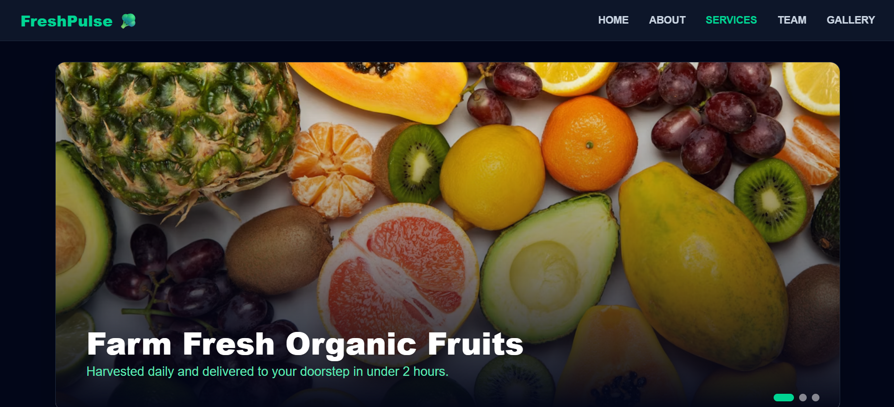
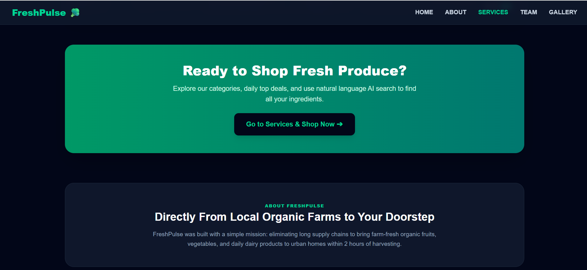
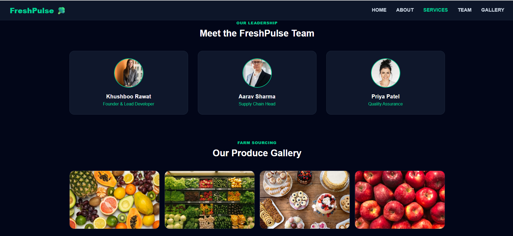
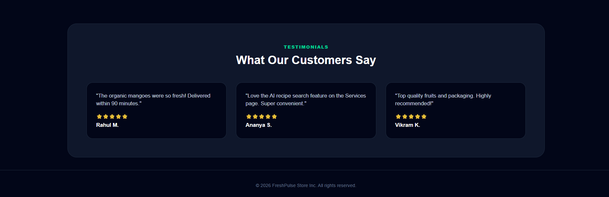
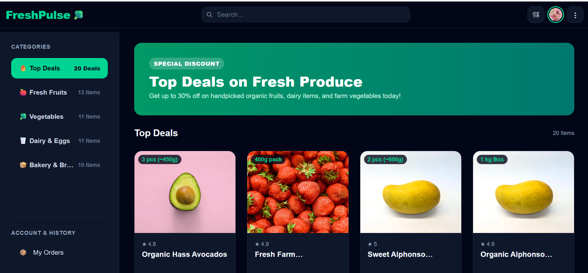
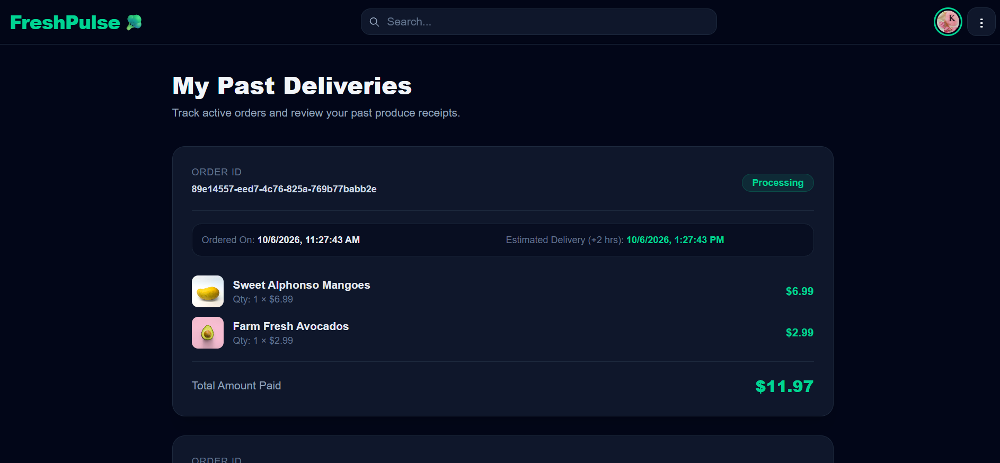
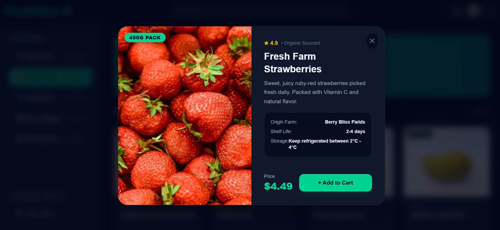
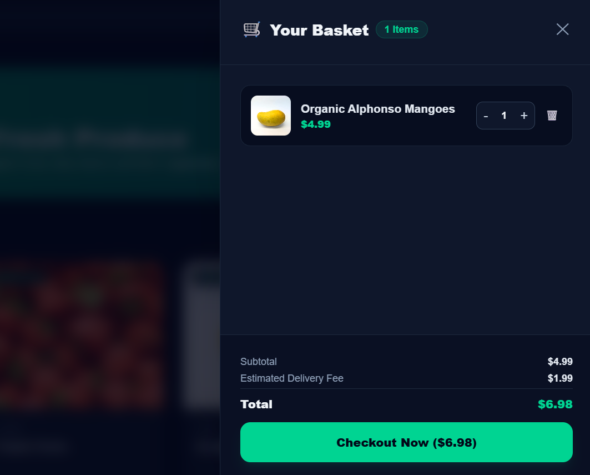

# 🥦 FreshPulse

FreshPulse is a modern, responsive web application for fresh produce and grocery delivery, built with Next.js, Tailwind CSS, NextAuth.js, and Supabase.

## ✨ Features
- 📱 Fully Responsive Design (Desktop, Tablet, and Mobile Drawer Navigation)
- 🔒 Google Authentication via NextAuth
- 🛒 Shopping Cart & Order Management powered by Supabase
- 🎨 Modern UI styled with Tailwind CSS

## 🛠️ Tech Stack
- **Framework:** [Next.js](https://nextjs.org/) (App Router)
- **Styling:** [Tailwind CSS](https://tailwindcss.com/)
- **Authentication:** [NextAuth.js](https://next-auth.js.org/) (Google OAuth)
- **Database:** [Supabase](https://supabase.com/)
- **Deployment:** [Vercel](https://vercel.com/)

## 🚀 Live Demo

- **Live Application:** [https://fresh-pulse-alpha.vercel.app](https://fresh-pulse-alpha.vercel.app)
- **Hosted On:** Vercel

## 📸 Application Preview

 

 

 

 

 

 

 

---
